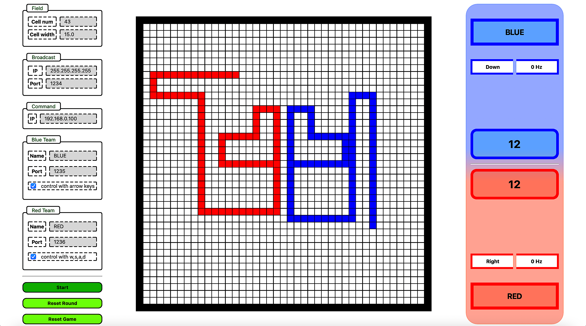

# Advanced Programming Course - Final Project
<p  align="center"> <b>Final Project - Fall 2022 Semester <br> Deadline: - </b> </p>

</br>

## Tron

This project provides a platform for teams to compete over the local network.

The game is based on a movie called Tron, in this game each team controls a snake and tries to avoid colliding with obstacles (the walls, its own body, or the rival's body). Each team that makes a longer stand in the field wins the round.


</br>
<p align="center">

</p>
</br>

</br>

## Broadcast
The platform broadcasts (on the ip and port provided in the *BroadCast* section) a json string over UDP with the information of the game at each step. The json string send by the platform is as follows:

```json
{
    "game_dim":43
    "game_state":"Running",
    "blue":"BLUE",
    "blue_heads":[[21,25],[21,24],[21,23]],
    "blue_score":0,
    "red":"RED",
    "red_heads":[[21,17],[21,18],[21,19]],
    "red_score":0
}
```

- **game_state** can be *'Running'* or *'Pause'* based on the state of the game.
- **blue** is the blue team name (can be configured from the config section)
- **blue_heads** contains the last 3 positions of blue tron's head (at the begining of the round it only contains the 1 or 2 position)
- **blue_score** score of blue team
- **red** is the red team name (can be configured from the config section)
- **red_heads** contains the last 3 positions of red tron's head (at the begining of the round it only contains the 1 or 2 position)
- **red_score** score of red team

</br>
</br>

## Control of Trons


- You can send your desired commands over UDP for the platform. the ip address to receive commands is in the *ip* section of the config and each team's port can be configured in the team's configuration section.
    
    you should send the desired direction for your tron:
    
    - *'Up'*
    - *'Right'*
    - *'Down'*
    - *'Left'*

</br>

- By enabling the checkboxes in the config section, you can also control the blue tron using *arrow keys* on your keyboard and similarly you can control the red tron using *w, a, s, d* keys. (use this option for your debugs and tests)
